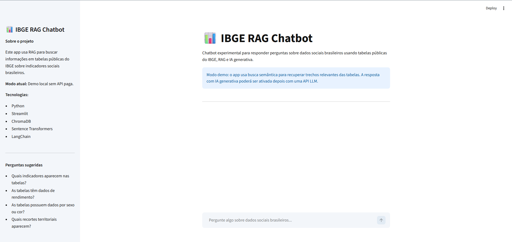
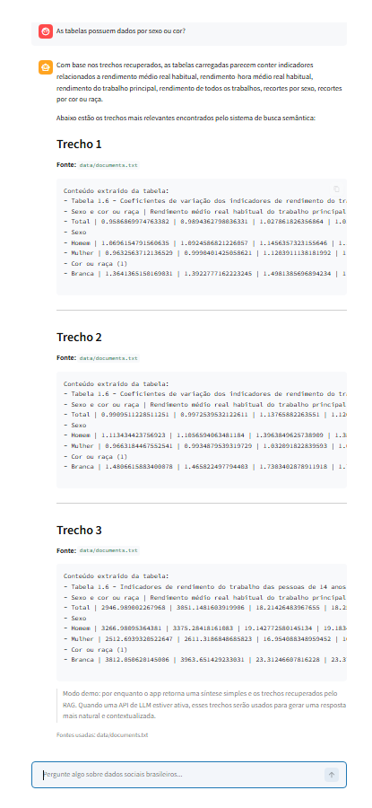

# IBGE RAG Chatbot

Chatbot experimental para responder perguntas sobre dados sociais brasileiros usando tabelas públicas do IBGE, busca semântica e Retrieval-Augmented Generation (RAG).

## Objetivo

O objetivo do projeto é demonstrar uma aplicação prática de Python, análise de dados, embeddings, banco vetorial e interface web com Streamlit.

O sistema permite que o usuário faça perguntas sobre indicadores sociais brasileiros e retorna trechos relevantes extraídos de tabelas públicas do IBGE.

## Tecnologias utilizadas

- Python
- Streamlit
- LangChain
- ChromaDB
- Sentence Transformers
- Pandas
- OpenPyXL
- xlrd

## Funcionalidades

- Leitura de tabelas `.xls`, `.xlsx` e `.csv`
- Conversão das tabelas para texto pesquisável
- Criação de base vetorial com ChromaDB
- Busca semântica com embeddings locais
- Interface web com Streamlit
- Exibição dos trechos e fontes utilizadas
- Modo demo sem dependência de API paga

## Screenshots

### Tela inicial



### Exemplo de resposta



## Dados utilizados

O projeto utiliza tabelas públicas do IBGE relacionadas a indicadores sociais brasileiros, incluindo informações sobre rendimento, trabalho, sexo, cor ou raça e recortes territoriais.

Exemplos de tabelas carregadas:

- Indicadores por Brasil
- Indicadores por Grandes Regiões e Unidades da Federação
- Indicadores por sexo e cor ou raça
- Indicadores de rendimento do trabalho

## Exemplos de perguntas

- Quais indicadores aparecem nas tabelas?
- As tabelas têm dados de rendimento?
- As tabelas possuem dados por sexo ou cor?
- Quais recortes territoriais aparecem?

## Estrutura do projeto

```text
ibge-rag-chatbot/
├── app.py
├── requirements.txt
├── README.md
├── data/
│   ├── documents.txt
│   └── tables/
├── src/
│   ├── rag.py
│   ├── vectorstore.py
│   ├── table_loader.py
│   ├── pdf_loader.py
│   ├── prompts.py
│   └── embedder.py
└── .streamlit/
    └── config.toml
```

## Como rodar localmente

Crie e ative o ambiente virtual:

```bash
python -m venv venv
venv\Scripts\activate
```

Instale as dependências:

```bash
pip install -r requirements.txt
```

Processe as tabelas:

```bash
python src/table_loader.py
```

Crie o índice vetorial:

```bash
python -c "from src.vectorstore import create_vectorstore; create_vectorstore(); print('Índice criado com sucesso')"
```

Rode o app:

```bash
streamlit run app.py
```

## Status do projeto

Versão atual: MVP funcional em modo demo local.

Nesta versão, o sistema recupera trechos relevantes das tabelas carregadas e apresenta uma síntese simples. Futuramente, o projeto pode ser integrado a uma API de LLM para gerar respostas mais naturais e contextualizadas.

## Cuidados de segurança

Este projeto não versiona arquivos `.env` nem chaves de API.
